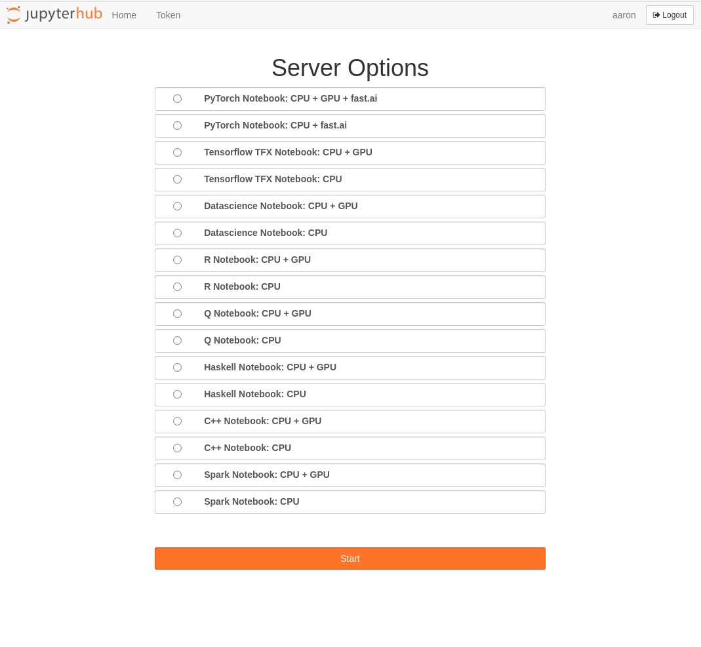

### JupyterLab

This project is where I customize JupyterLAB to support multiple environments:

and add GPU support to the docker stacks build images.

                                  cudabase
                                     |
                                  base-nb
                                  /       
                             minimal-nb              
                                  |
                             minimal-ext-nb (common)
                +-----------------+------------------+
            scipy-nb          spark-ext-nb          ihaskell-nb          
            /      \                  \             xeus-cling-nb
	datascience-nb  tensorflow-nb   pyspark-nb      r-nb
    pytorch-nb            |             \           q-nb
                         tfx-nb      all-spark-nb
                                     
                                               
           
                     

References:
---
[KubeSpawner](https://jupyterhub-kubespawner.readthedocs.io/en/latest/overview.html)

[Docker Stacks](http://jupyter-docker-stacks.readthedocs.io/en/latest/)

[Helm Charts](https://jupyterhub.github.io/helm-chart/)